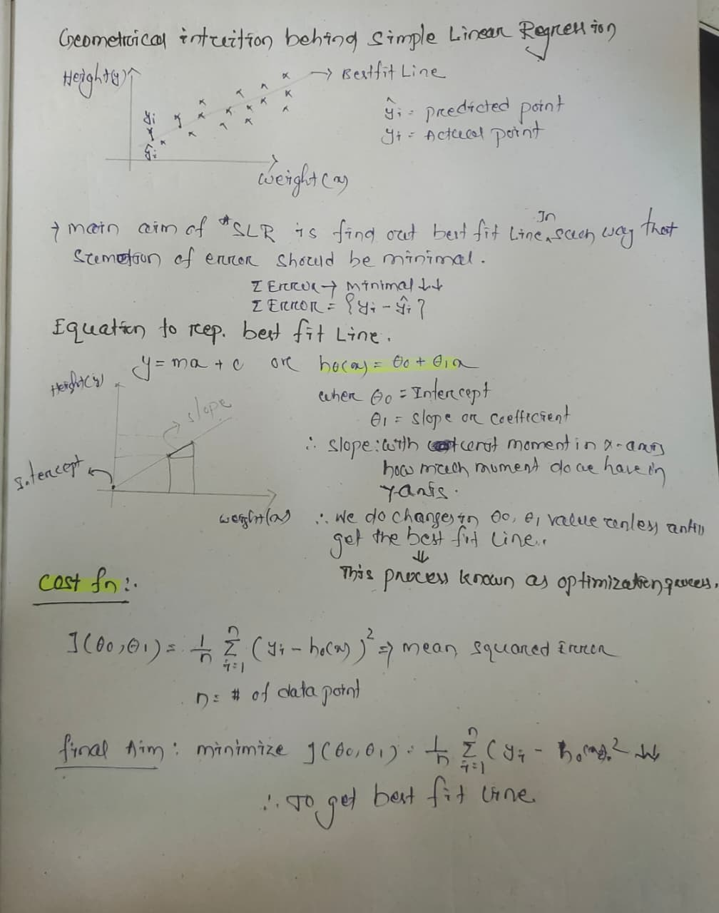
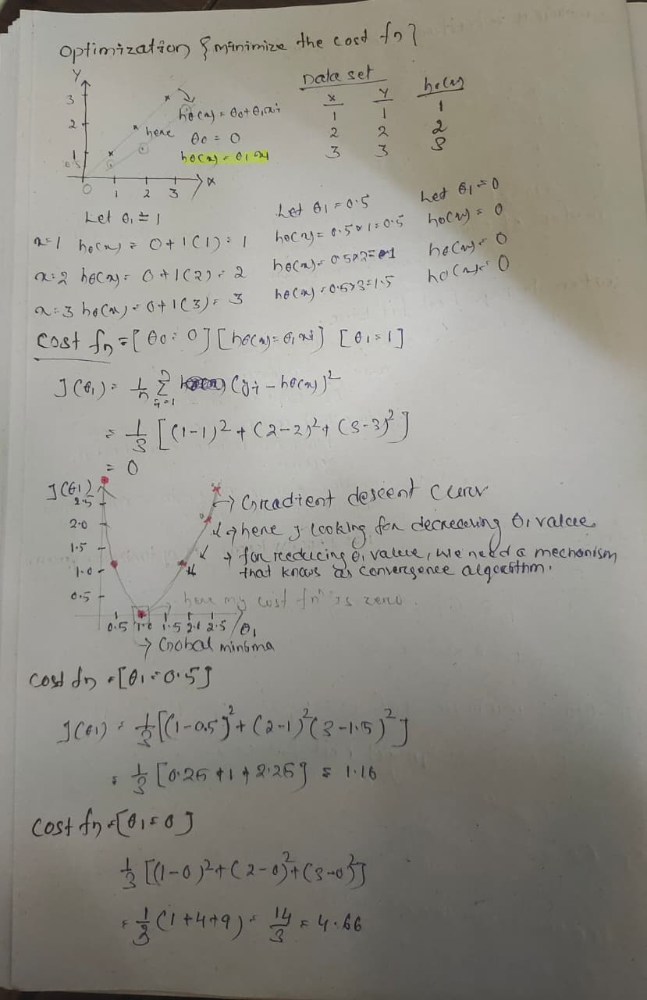
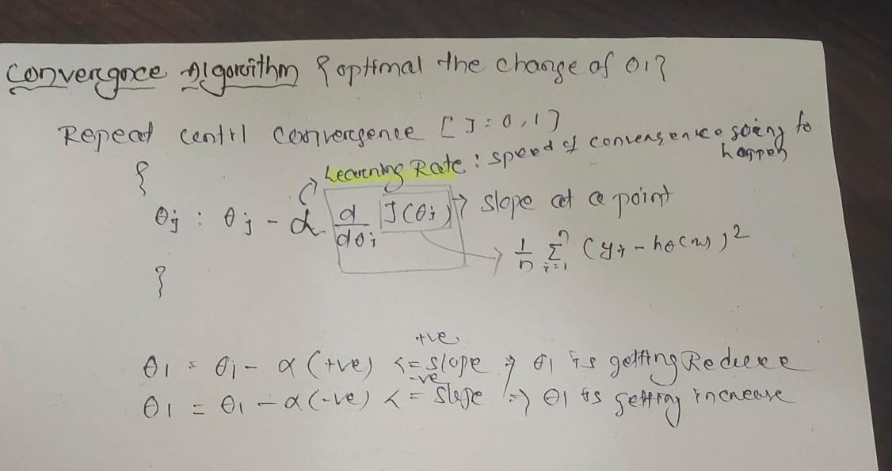

## Supervised ML 
- Regression
    - o/p --> continious
- Classification
    - o/p --> Binary, multiclass catagories
 ## Simple Linear Regression     
### Dataset

| Weight(indepent feature)    | Hight(dependent feature)     | 
|------------|------------|
| 74         |  170cm     | 
| 80         |  180cm     |
| 75         |  175.5cm   |
|  -         |  -         |
|   -        |    -        ||
- **o/p id depndent feature** bcz acc to the inde. feature depend. feature keeps changing .
- Here our agenda is we train a model , after train , when we give new weight it will predict a new height.
- In simple linear regression we have **one i/p and one o/p** features.
- In multiple linear regression we have **multiple i/ps one o/p**(dependent feature)
- **Note** all the time their will be a dependent feature , which we need to predict.
  

